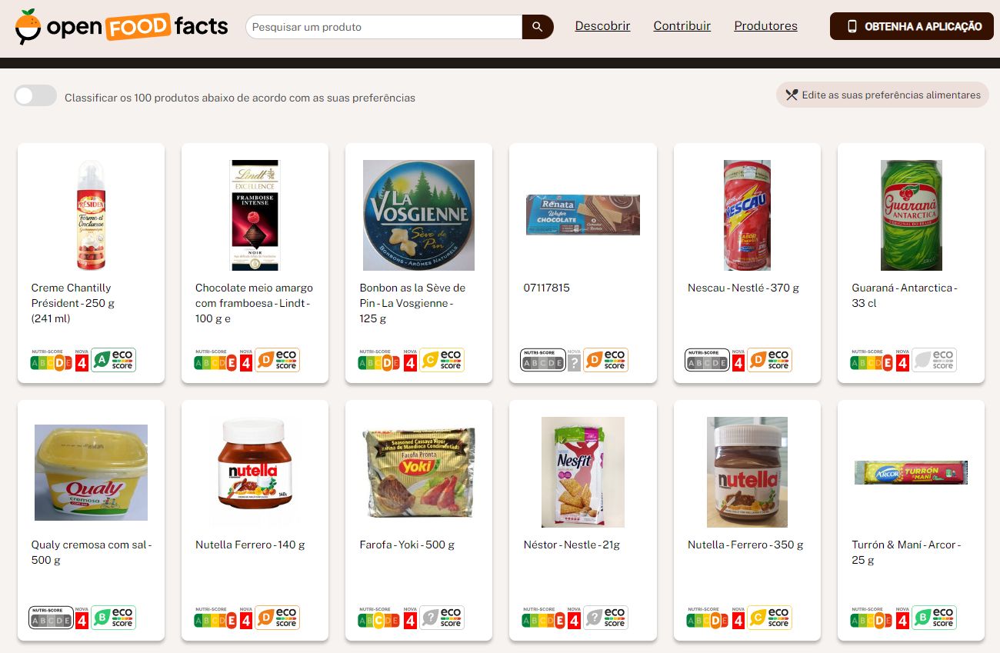
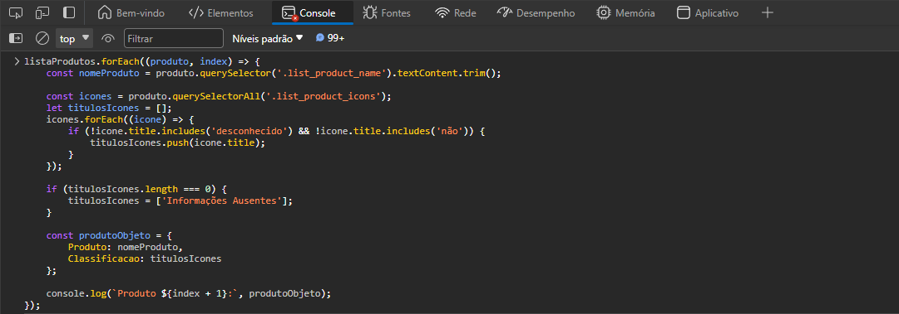
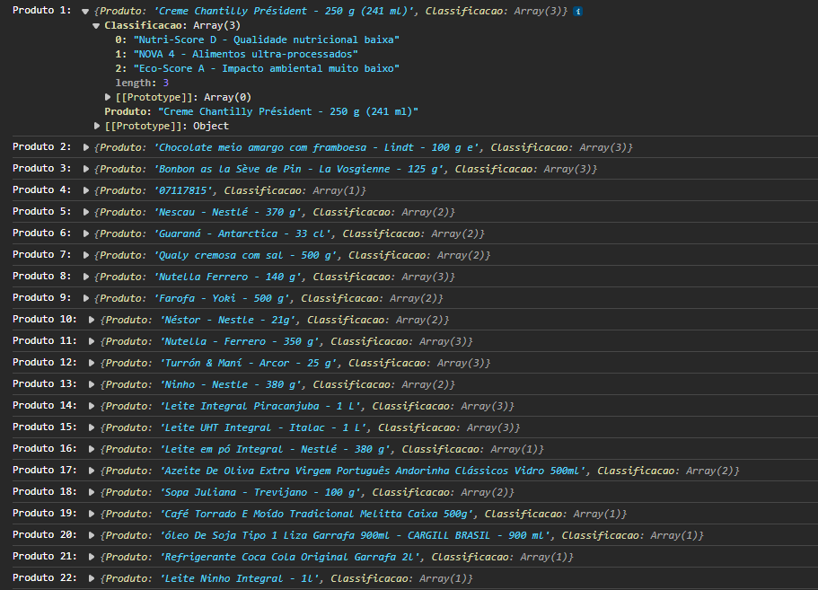

# Passo a Passo

* Abra o navegador ( Utilizei o Microsoft Edge )
* Acesse o site: https://br.openfoodfacts.org/
* Pressione F12
* Com o DevTools aberto clique nos `...` >> `Configurações` >> `Experimentos` >> Desmaque a opção `Show warning about Self-XSS when pasting code`
* Copie o Script
```
listaProdutos.forEach((produto, index) => {
    const nomeProduto = produto.querySelector('.list_product_name').textContent.trim();

    const icones = produto.querySelectorAll('.list_product_icons');
    let titulosIcones = [];
    icones.forEach((icone) => {
        if (!icone.title.includes('desconhecido') && !icone.title.includes('não')) {
            titulosIcones.push(icone.title);
        }
    });

    if (titulosIcones.length === 0) {
        titulosIcones = ['Informações Ausentes'];
    }

    const produtoObjeto = {
        Produto: nomeProduto, 
        Classificacao: titulosIcones 
    };

    console.log(`Produto ${index + 1}:`, produtoObjeto);
});

```
* Cole no console e pressione enter
* Uma lista dos produtos será exibida no console.log()

# Imagens

<div>
  
  
  
</div>
